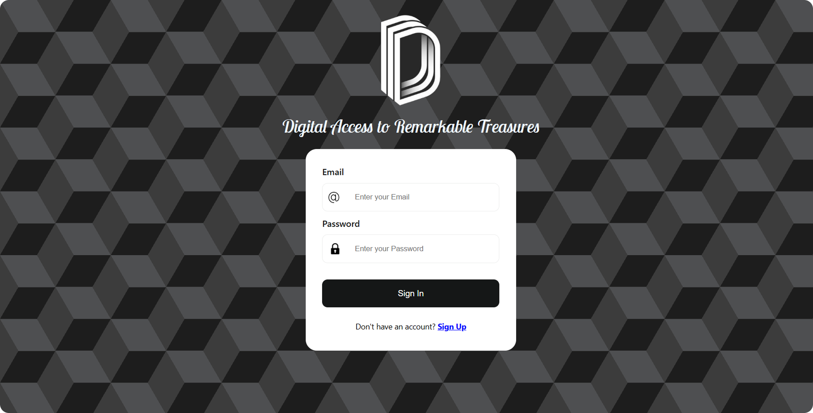
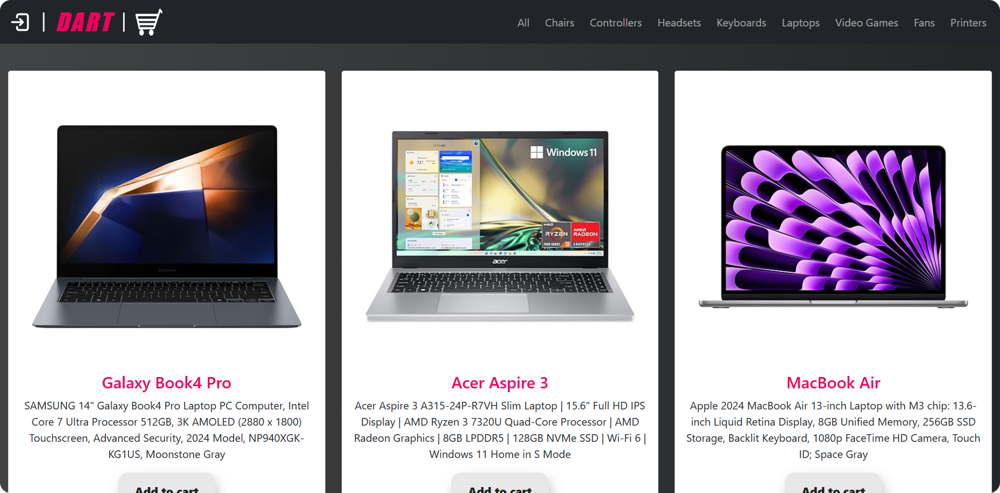
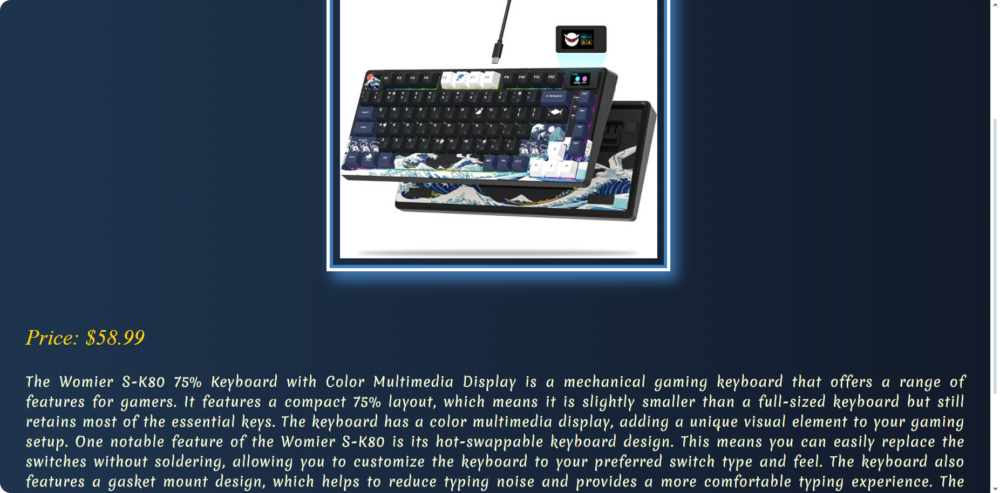
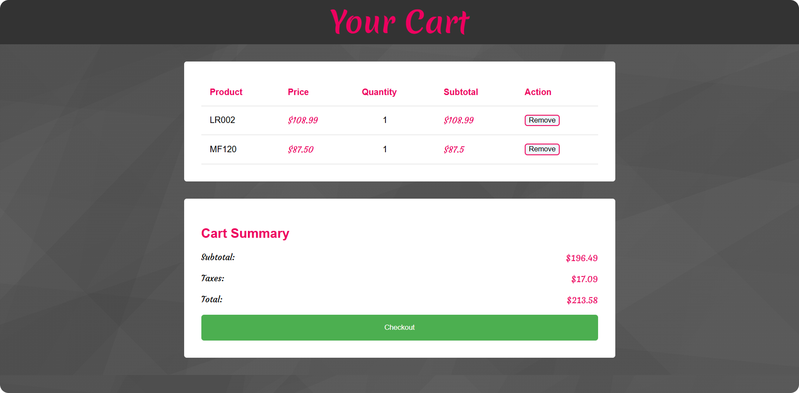
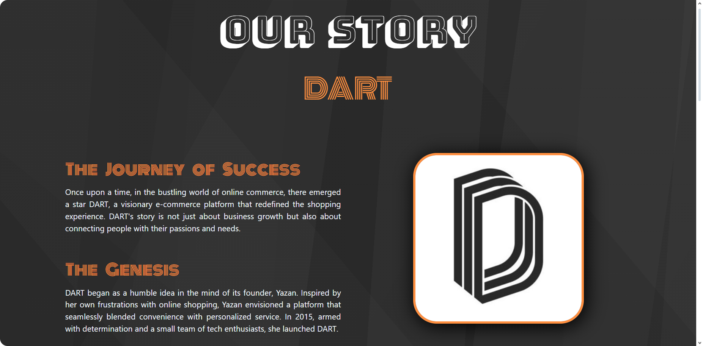
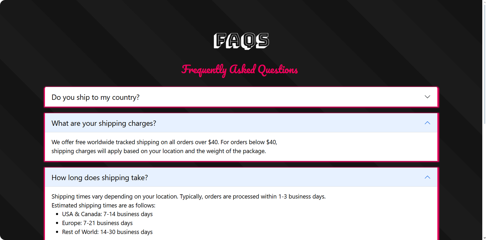
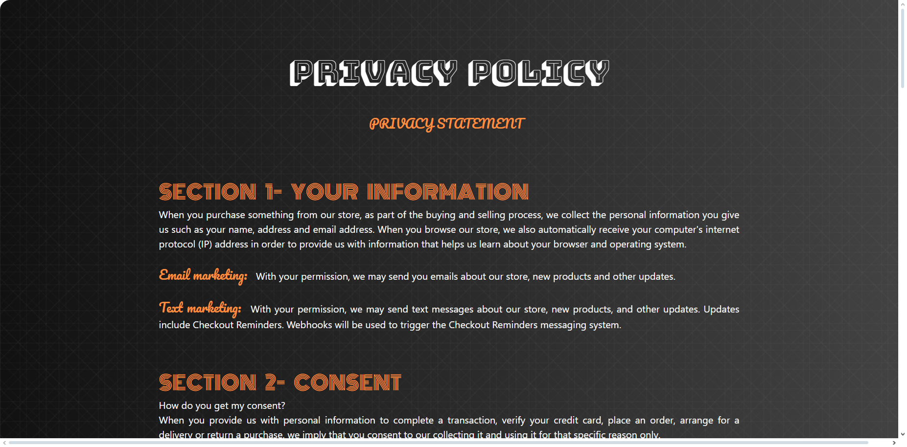
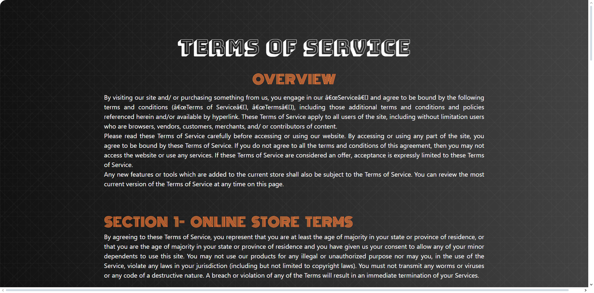
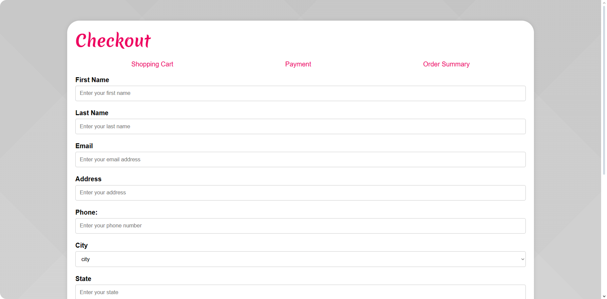
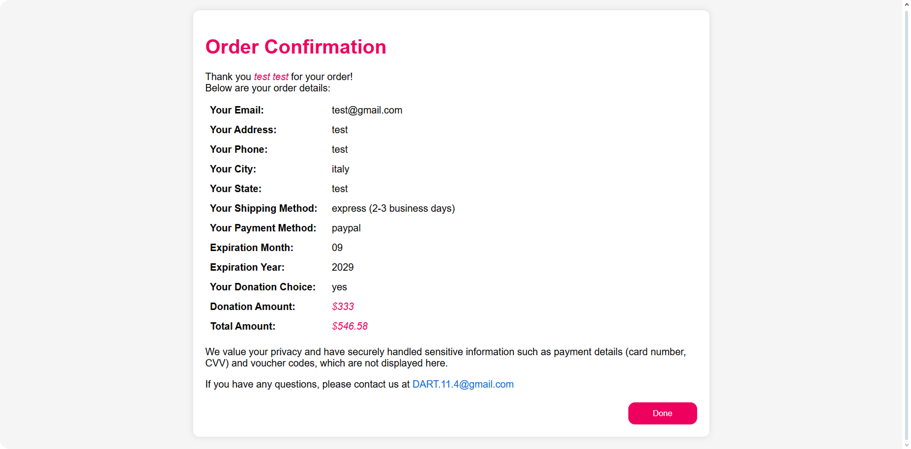

<div align="center">

# DART - Digital Access to Remarkable Treasures

A full-stack e-commerce platform built with PHP, MySQL, and Bootstrap.

</div>

---

## Table of Contents

- [About](#about)
- [Features](#features)
- [Tech Stack](#tech-stack)
- [Project Structure](#project-structure)
- [Database Schema](#database-schema)
- [Getting Started](#getting-started)
  - [Prerequisites](#prerequisites)
  - [Installation](#installation)
- [Usage](#usage)
- [Screenshots](#screenshots)
- [Contributors](#contributors)

---

## About

**DART** (Digital Access to Remarkable Treasures) is a fully functional e-commerce web application that provides a complete online shopping experience. Users can browse a diverse catalog of products, create accounts, manage their shopping carts, and complete purchases through a multi-step checkout process with multiple payment options.

The platform was built as an academic project at **Princess Sumaya University for Technology (PSUT)**, demonstrating practical full-stack web development skills including server-side programming, relational database design, session management, and responsive front-end development.

---

## Features

### Authentication & User Management
- User registration with email and phone number uniqueness validation
- Secure sign-in with session-based authentication
- Password strength validation (client-side and server-side)
- Logout functionality with session destruction

### Product Catalog
- Browse products across **8 categories**: Chairs, Controllers, Headsets, Keyboards, Laptops, Video Games, Fans, and Printers
- Filter products by category via the navigation bar
- Randomized product display on the "All" view for discovery
- Individual product detail pages with full descriptions
- Stock-aware display (out-of-stock items are hidden)

### Shopping Cart
- Add products to cart with AJAX (no page reload)
- Toast notifications on successful cart additions
- View, update quantities, and remove items from cart
- Persistent cart storage linked to user accounts in the database

### Checkout & Orders
- Multi-step checkout form with shipping and billing details
- Country selection from 30+ supported destinations
- Three shipping methods: Standard, Express, and Overnight
- Seven payment options: Credit Card, Debit Card, PayPal, Bank Transfer, Apple Pay, Google Pay, and Cash on Delivery
- Conditional payment information fields (card details shown only for card-based payments)
- Voucher code support
- Optional donation for charitable causes
- Order confirmation with summary

### Additional Pages
- **Our Story** - Brand narrative and company history
- **Meet the Team** - Team member profiles with photos and bios
- **FAQs** - Frequently asked questions
- **Privacy Policy** and **Terms of Service**

### UI/UX
- Fully responsive design using Bootstrap 5 grid system
- Custom fonts (Pacifico, Lobster Two, Monoton, Bungee Shade, and more)
- Dark-themed navigation bar with branded styling
- Animated "Add to Cart" button with hover effects
- Social media links (Facebook, X/Twitter, Instagram) with animated tooltips
- Mobile-friendly navigation with collapsible hamburger menu

---

## Tech Stack

| Layer      | Technology                          |
|------------|-------------------------------------|
| Frontend   | HTML5, CSS3, JavaScript, jQuery     |
| Framework  | Bootstrap 5                         |
| Backend    | PHP 8.x                             |
| Database   | MySQL / MariaDB                     |
| Server     | Apache (XAMPP / WAMP / MAMP)        |

---

## Project Structure

```
DART-Website/
├── Project/
│   ├── CSS/
│   │   ├── style.css              # Global styles, footer, social icons
│   │   └── signInOut.css          # Authentication form styles
│   ├── Fonts/                     # Custom font files (.ttf)
│   ├── HTML/
│   │   ├── HomePage.html          # Portfolio / landing page
│   │   ├── Story.html             # Our Story page
│   │   ├── Team.html              # Team member profiles
│   │   ├── FAQs.html              # Frequently Asked Questions
│   │   ├── privacyPolicy.html     # Privacy Policy
│   │   ├── termsOfService.html    # Terms of Service
│   │   └── test.html              # Testing page
│   ├── Images/
│   │   ├── Logos/                 # Brand logos and favicons
│   │   ├── Products/              # Product images by category
│   │   │   ├── chairs_1/
│   │   │   ├── controllers_2/
│   │   │   ├── headsets_3/
│   │   │   ├── keyboards_4/
│   │   │   ├── laptops_5/
│   │   │   ├── video games_6/
│   │   │   ├── fans_7/
│   │   │   └── printers_8/
│   │   ├── HomePage/              # Homepage carousel/banner images
│   │   ├── Form Images/           # Auth form icons
│   │   ├── backgrounds/           # Background images
│   │   └── others/                # Miscellaneous assets
│   └── php/
│       ├── connectToDB.php        # Database connection config
│       ├── SignIn.php             # User login
│       ├── signUp.php             # User registration
│       ├── MainPage.php           # Main product catalog page
│       ├── product_display.php    # Individual product detail page
│       ├── cart.php               # Shopping cart view
│       ├── add_to_cart.php        # AJAX endpoint for adding to cart
│       ├── remove_cart_item.php   # Remove item from cart
│       ├── checkout.php           # Checkout form
│       ├── confirmation.php       # Order confirmation
│       └── log_out.php            # Session logout
├── dart.sql                       # Database schema and seed data
├── DB tables diagram.pdf          # Visual ER diagram
└── README.md
```

---

## Database Schema

The application uses a relational MySQL database named `dart` with the following tables:

### `customers`
| Column          | Type         | Description                |
|-----------------|--------------|----------------------------|
| `customer_id`   | INT (PK)     | Auto-increment primary key |
| `customer_name` | VARCHAR(50)  | Customer's full name       |
| `email`         | VARCHAR(60)  | Unique email address       |
| `password`      | VARCHAR(60)  | Account password           |
| `phone_number`  | VARCHAR(10)  | 10-digit phone number      |

### `products`
| Column             | Type          | Description                        |
|--------------------|---------------|------------------------------------|
| `product_id`       | INT (PK)      | Auto-increment primary key         |
| `product_type`     | INT           | Category ID (1-8)                  |
| `product_name`     | VARCHAR(30)   | Product display name               |
| `description`      | TEXT          | Short description                  |
| `price`            | DECIMAL(6,2)  | Product price in USD               |
| `stock`            | INT           | Available inventory count          |
| `image`            | BLOB          | Product image (stored as binary)   |
| `long_description` | VARCHAR(3000) | Detailed product description       |

### `carts`
| Column        | Type     | Description                         |
|---------------|----------|-------------------------------------|
| `cart_id`     | INT (PK) | Auto-increment primary key         |
| `customer_id` | INT (FK) | References `customers.customer_id` |

### `cart_items`
| Column         | Type     | Description                       |
|----------------|----------|-----------------------------------|
| `cart_item_id` | INT (PK) | Auto-increment primary key       |
| `cart_id`      | INT (FK) | References `carts.cart_id`       |
| `product_id`   | INT (FK) | References `products.product_id` |
| `quantity`     | INT      | Number of items                   |

### `orders`
| Column             | Type          | Description                          |
|--------------------|---------------|--------------------------------------|
| `order_id`         | INT (PK)      | Auto-increment primary key           |
| `customer_id`      | INT (FK)      | References `customers.customer_id`   |
| `first_name`       | VARCHAR(50)   | Shipping first name                  |
| `last_name`        | VARCHAR(50)   | Shipping last name                   |
| `email`            | VARCHAR(100)  | Contact email                        |
| `address`          | VARCHAR(255)  | Shipping address                     |
| `phone`            | VARCHAR(20)   | Contact phone                        |
| `city`             | VARCHAR(50)   | Destination city/country             |
| `state`            | VARCHAR(50)   | State/province                       |
| `shipping_method`  | VARCHAR(50)   | Standard / Express / Overnight       |
| `voucher_code`     | VARCHAR(50)   | Applied voucher code                 |
| `payment_method`   | VARCHAR(50)   | Selected payment method              |
| `card_number`      | VARCHAR(20)   | Card number (if applicable)          |
| `expiration_month` | VARCHAR(2)    | Card expiry month                    |
| `expiration_year`  | VARCHAR(4)    | Card expiry year                     |
| `cvv`              | VARCHAR(3)    | Card CVV                             |
| `donation`         | VARCHAR(3)    | Yes/No donation flag                 |
| `donation_amount`  | DECIMAL(10,2) | Donation amount in USD               |
| `total_amount`     | DECIMAL(10,2) | Order total in USD                   |

> For a visual representation of the schema relationships, see `DB tables diagram.pdf` in the project root.

---

## Getting Started

### Prerequisites

- **PHP 8.x** or higher
- **MySQL 5.7+** or **MariaDB 10.4+**
- **Apache** web server (included in XAMPP, WAMP, or MAMP)
- A web browser (Chrome, Firefox, Safari, or Edge)

### Installation

1. **Clone the repository**

   ```bash
   git clone https://github.com/SamiAbuTouq/DART-Website.git
   ```

2. **Move the project to your web server directory**

   ```bash
   # For XAMPP (Windows)
   cp -r DART-Website /c/xampp/htdocs/

   # For XAMPP (macOS)
   cp -r DART-Website /Applications/XAMPP/htdocs/

   # For MAMP (macOS)
   cp -r DART-Website /Applications/MAMP/htdocs/
   ```

3. **Create the database**

   - Open **phpMyAdmin** at `http://localhost/phpmyadmin`
   - Create a new database named `dart`
   - Import the `dart.sql` file from the project root to create tables and seed data

4. **Configure the database connection**

   Open `Project/php/connectToDB.php` and verify the connection settings match your environment:

   ```php
   $servername = "localhost";
   $username = "root";
   $password = "";       // Default for XAMPP (no password)
   $dbname = "dart";
   ```

5. **Start the server**

   - Launch Apache and MySQL from your XAMPP/WAMP/MAMP control panel
   - Navigate to `http://localhost/DART-Website/Project/php/SignIn.php` in your browser

---

## Usage

1. **Create an account** - Visit the Sign Up page to register with your name, email, phone number, and password.
2. **Browse products** - After signing in, explore the catalog. Use the category navigation to filter by product type.
3. **Add to cart** - Click "Add to cart" on any product. A toast notification confirms the item was added.
4. **Review your cart** - Click the cart icon in the navigation bar to view and manage your selected items.
5. **Checkout** - Fill in your shipping details, select a payment method, and optionally enter a voucher code.
6. **Order confirmation** - After placing your order, a confirmation page displays your order summary.

---

## Screenshots

# Screenshots

## Screenshots

<table>
<tr>
<td></td>
<td></td>
</tr>

<tr>
<td></td>
<td></td>
</tr>

<tr>
<td></td>
<td></td>
</tr>

<tr>
<td></td>
<td></td>
</tr>

<tr>
<td></td>
<td></td>
</tr>


</table>
---

## Contributors

| Name                   | Role             | University                                     |
|------------------------|------------------|-------------------------------------------------|
| **Sami Abu Touq**      | Lead Developer   | Princess Sumaya University for Technology (PSUT) |
| **Yazan Bdair**         | Developer        | Princess Sumaya University for Technology (PSUT) |
| **Muhammad Almujahed**  | Developer        | Princess Sumaya University for Technology (PSUT) |


